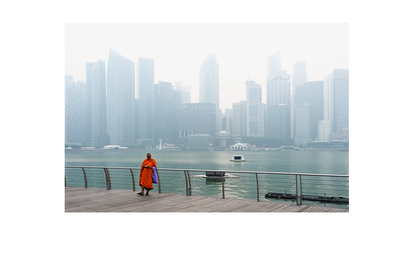
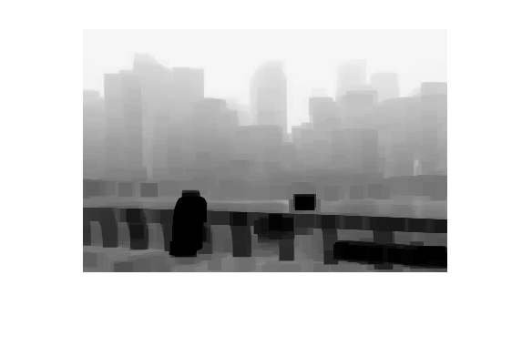
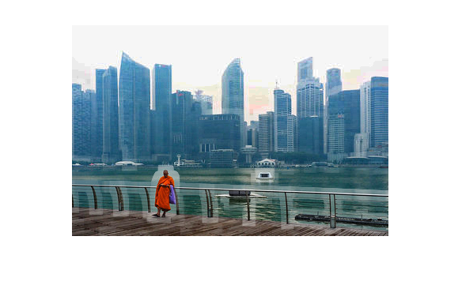

# Haze Removal Using Dark Channel Prior

This project was implemented as part of **CS 663: Fundamentals of Digital Image Processing** at **IIT Bombay** during Autumn 2021 under **Prof. Ajit Rajwade**. The goal is to remove haze from outdoor images using the **Dark Channel Prior** technique.

## Table of Contents
1. [Introduction](#introduction)
2. [Files and Scripts](#files-and-scripts)
3. [Implementation](#implementation)
4. [Results](#results)
5. [Observations](#observations)
6. [How to Run](#how-to-run)
7. [Contributors](#contributors)

---

## Introduction

Haze removal or image dehazing is a technique to improve the visibility of outdoor images by estimating the scene transmission and recovering the radiance of the image. This project implements:
- Dark Channel Prior for estimating haze-free images.
- **With/Without Guided Filtering** to reduce artifacts and improve edge preservation.

---

## Files and Scripts

1. **With_soft_matting.m**  
   MATLAB script to perform haze removal with soft matting (Guided Filter).

2. **Without_soft_matting.m**  
   MATLAB script to perform haze removal without soft matting.

3. **Haze_Removal.pdf**  
   Detailed project report explaining the algorithm, equations, and results.

4. **Datasets/Our_dataset/**  
   Contains input hazy images used for testing.

5. **Results/**  
   Outputs of the dehazed images with and without the Guided Filter.

---

## Implementation

The key steps of the haze removal process are as follows:

1. **Dark Channel Prior Estimation**:  
   The dark channel is calculated by finding the minimum pixel values in RGB channels over patches.

2. **Atmospheric Light Estimation**:  
   Identifies the brightest pixels in the dark channel to estimate the global atmospheric light \( A \).

3. **Transmission Map Estimation**:  
   Transmission \( t(x) \) is estimated based on the dark channel prior.

4. **Guided Filtering** *(optional)*:  
   Used to refine the transmission map and reduce artifacts.

5. **Scene Radiance Recovery**:  
   The final dehazed image is recovered using the estimated transmission and atmospheric light.

---

## Results

### Without Guided Filter
Artifacts like **halo effects** and **block artifacts** appear because the transmission map assumes constant transmission over patches.

| Hazy Image | Dark Channel | Dehazed Image |
|------------|--------------|---------------|
|  |  |  |

---

### With Guided Filter
Guided Filter improves results by refining the transmission map and preserving edges.

| Hazy Image | Dehazed Image | RMSE Value |
|------------|---------------|------------|
|   |  | **0.198** |
|   |  | **0.000** |
|   |  | **0.244** |

---

## Observations

- Without Guided Filter, **halo and block artifacts** are prominent.  
- Using **Guided Filter**, artifacts are removed due to edge-preserving properties.  
- Edge preservation is beyond the project's scope but significantly improves results.

---

## How to Run

1. Install MATLAB and ensure the `Image Processing Toolbox` is available.  
2. Clone this repository:
   ```bash
   git clone https://github.com/TheShiningVampire/Haze_Removal_CS663_Project.git
   cd Haze_Removal_CS663_Project
   ```
3. Run the scripts:
   - For haze removal **without guided filtering**:
     ```matlab
     Without_soft_matting
     ```
   - For haze removal **with guided filtering**:
     ```matlab
     With_soft_matting
     ```
4. Output images will be saved in the `Results` folder.

---

## References

- K. He, J. Sun, and X. Tang, *"Single Image Haze Removal Using Dark Channel Prior"*, CVPR 2009.
